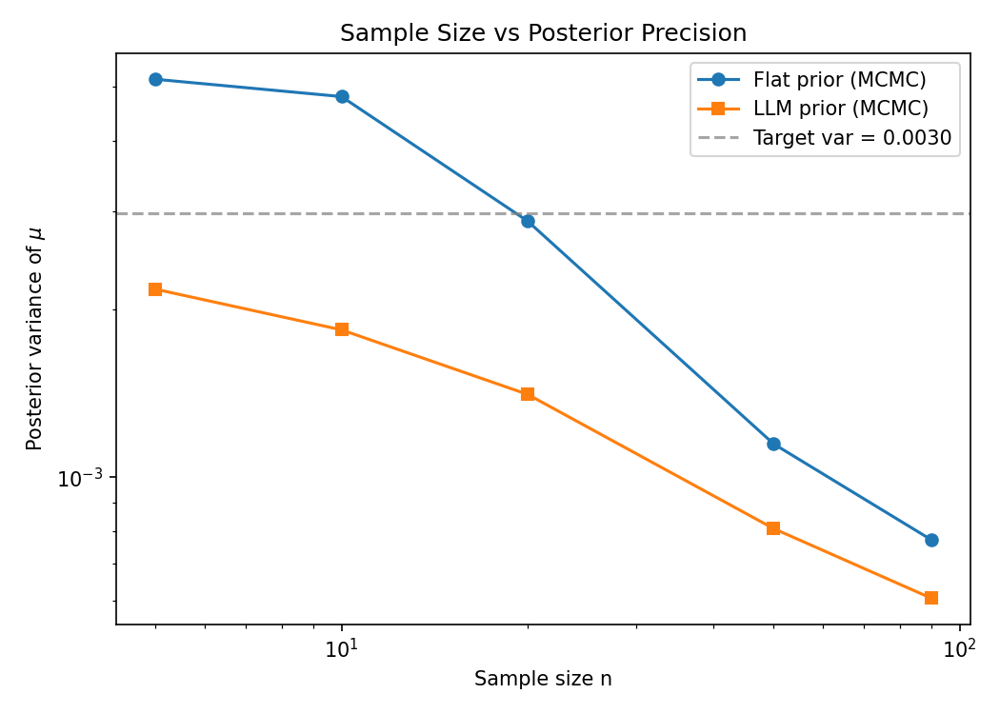
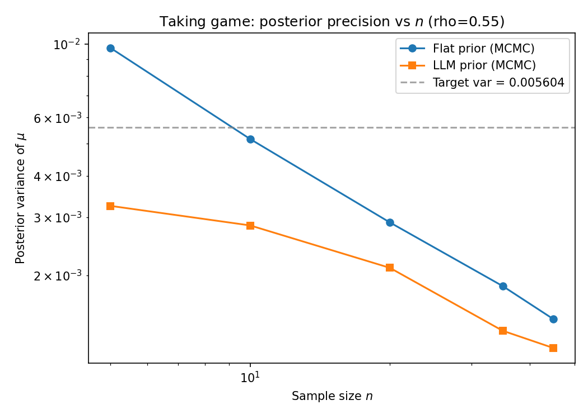
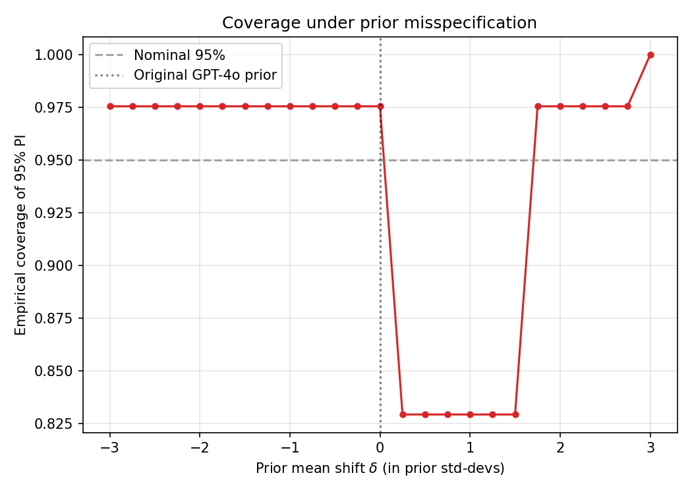
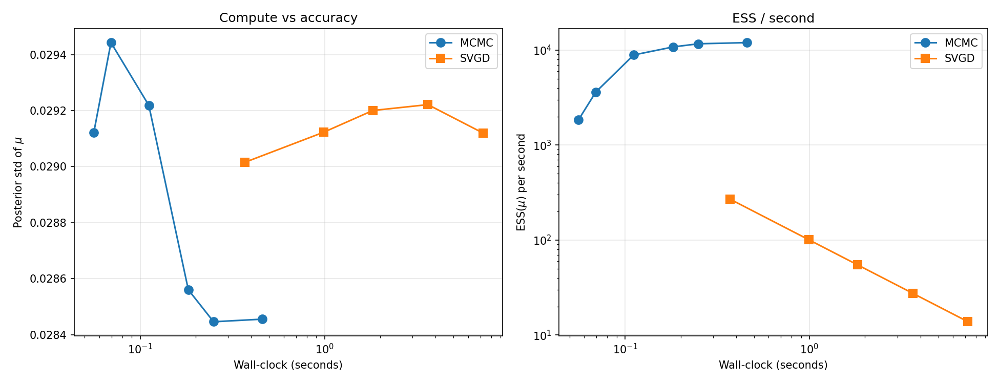

# LLM-Informed Bayesian Priors

### Reducing Experimental Cost in Behavioral Economics

Bo Feng &middot; CSE 8803 IUQ &middot; Spring 2026 &middot; Georgia Tech

<div class="text-sm opacity-70 mt-12">
Final presentation &middot; April 27, 2026
</div>

<!--
Hi, I'm Bo Feng. This is my final presentation for CSE 8803 IUQ, Inverse Problems Under
Uncertainty. The project asks: can large language model simulations save us human
experimental observations in Bayesian inference, and where does it break?
-->

---

## The cost problem

- A behavioral economics study costs **\$10–\$50 per participant**, plus IRB and lab time
- A typical condition needs **80–200 subjects** to estimate a single parameter precisely
- An LLM, prompted with the same instructions, produces **500 simulated decisions in a few minutes**

<div class="mt-8">

> **Question.** How much real data does an LLM prior save, and when does it break calibration?

</div>

<!--
Recruiting 200 subjects easily costs ten thousand dollars and weeks of IRB. Meanwhile a
contemporary LLM responds to the same prompt the experimenter would read aloud, in seconds,
for cents. The natural UQ question: can we treat the LLM as an informative Bayesian prior?
That's the project.
-->

---

## Setup

<div class="grid grid-cols-2 gap-8">
<div>

### Data
- 137 dictator-game decisions
- von Blanckenburg et al., 2023
- 69 giving-game, 68 taking-game
- Train/test split: 96 / 41 (30%)

### Likelihood
$$y_i \mid \alpha, \beta \sim \text{Beta}(\alpha, \beta)$$
$$\mu = \tfrac{\alpha}{\alpha+\beta}$$

</div>
<div>

### Quantity of Interest
$$\rho \;=\; \frac{n^*_{\mathrm{LLM}}}{n^*_{\mathrm{flat}}}$$

$n^*$ is the smallest sample size to bring $\mathrm{Var}(\mu \mid \mathbf{y})$ below a target.

$\rho < 1$ means the LLM prior saves human data.

</div>
</div>

<!--
The data: 137 individual decisions on dictator games where someone splits 10 euros with
a stranger. We use the Beta likelihood for the share. The headline number is rho:
fraction of human sample size needed to reach the same precision when we have an LLM prior.
-->

---

## Two methods

<div class="grid grid-cols-2 gap-6">
<div>

### Baseline
**Flat prior + MH-MCMC** (log-space, with Jacobian)
- $p(\alpha, \beta) \propto 1$ on $(0, 100)^2$
- 15k samples, 3k burn-in
- Acceptance rate 0.22–0.58 ✓

</div>
<div>

### Frontier
**LLM power prior + SVGD**
- $M=500$ pseudo-obs from GPT-4o
- $p_{\mathrm{LLM}} \propto \prod_j \text{Beta}(\tilde{y}_j; \alpha, \beta)^{w/M}$
- $w = 20$ effective weight
- SVGD: 100 particles, RBF kernel, Adam

</div>
</div>

<div class="mt-8">

$$
\bm{\eta}^{(k)}_{t+1}
= \bm{\eta}^{(k)}_t + \tfrac{\epsilon}{K}\sum_{\ell=1}^K
\!\left[\kappa(\bm{\eta}^{(\ell)}_t, \bm{\eta}^{(k)}_t)\,\nabla \log p(\bm{\eta}^{(\ell)}_t \mid \mathbf{y})
+ \nabla_{\bm{\eta}^{(\ell)}_t}\kappa(\bm{\eta}^{(\ell)}_t, \bm{\eta}^{(k)}_t)\right]
$$

</div>

<!--
The baseline is Metropolis-Hastings in log-space — gives me positivity for free with one
Jacobian correction. The LLM power prior is a single-knob construction from Ibrahim and
Chen 2000: each pseudo-observation contributes weight w/M to the log-likelihood. SVGD
follows Liu and Wang 2016: an interacting particle system whose update is the kernelized
score.
-->

---

## Main result: giving game

<div class="grid grid-cols-3 gap-6">
<div class="col-span-2">



</div>
<div class="text-sm">

| n  | Var ratio |
|----|-----------|
| 5  | 2.38× |
| 10 | 2.62× |
| 20 | 2.04× |
| 50 | 1.42× |
| 90 | 1.27× |

<div class="mt-4 text-base">

$n^*_{\mathrm{flat}} = 19.2$
$n^*_{\mathrm{LLM}} = 5.0$

**$\rho = 0.26$**

74% smaller human sample to reach the same posterior precision.

</div>

</div>
</div>

<!--
Headline result on the giving game. The LLM prior cuts the human sample in roughly
1/4. Most of the gain is at small n, which makes sense: the prior contributes 20 effective
pseudo-observations, so when you only have 5 humans, 25/5 = 5x improvement is the analytic
ceiling.
-->

---

## Cross-game replication: taking game

<div class="grid grid-cols-3 gap-6">
<div class="col-span-2">



</div>
<div class="text-sm">

| n  | Var ratio |
|----|-----------|
| 5  | 3.00× |
| 10 | 1.82× |
| 20 | 1.37× |
| 35 | 1.36× |
| 45 | 1.22× |

<div class="mt-4 text-base">

$\rho_{\mathrm{taking}} = 0.55$

vs. $\rho_{\mathrm{giving}} = 0.26$

**The LLM prior generalizes — partially.**

</div>

</div>
</div>

<!--
Phillip's strongest suggestion: do this on the taking game. Result: rho = 0.55, twice as
high. Why? GPT-4o under the taking prompt has counterpart-kept share of 0.52, but humans
in the taking game keep only 0.34 — humans take more aggressively than the LLM. The LLM
generalizes the protocol but not the framing-induced behavioral shift.
-->

---

## Failure mode: dense misspecification curve

<div class="grid grid-cols-2 gap-6">
<div>



</div>
<div class="text-sm pt-8">

- Shift the LLM prior by $\delta$ prior std-deviations
- Coverage of nominal-95% PI on held-out

**Asymmetric failure**:
- $\delta \le 0$: stays calibrated
- $\delta \approx +1$: coverage drops
- $\delta \ge +2$: data wins

**Moderate misspecification is the dangerous regime**, not extreme. The data overrides extreme priors but not subtle ones.

</div>
</div>

<!--
This is the failure mode I would worry about in deployment: not a totally wrong prior,
but a prior that's about one standard deviation off in the bad direction. The data won't
override it. The check-in had this as a 5-point table; here it's a continuous curve.
-->

---

## Compute–accuracy: MCMC vs SVGD



<div class="grid grid-cols-2 gap-6 mt-4 text-sm">
<div>

**MCMC at d=2**: ESS/sec ≈ $1.2 \times 10^4$
**SVGD at d=2**: ESS/sec ≈ $14$–$270$

</div>
<div>

For this 2-parameter Beta posterior, **MCMC dominates SVGD by ~100×**.

SVGD's value lives in higher-d posteriors with multi-modality, not here.

</div>
</div>

<!--
Honest reporting: at d=2 with a unimodal Beta posterior, MH-MCMC eats SVGD's lunch.
Two orders of magnitude in ESS per second. Why include SVGD then? Because in the
hierarchical extension I sketch in the discussion, MCMC mixing degrades and SVGD's
particle update doesn't.
-->

---

## Leakage check: gpt-3.5-turbo (Sep 2021 cutoff)

<div class="text-sm">

| Model | Cutoff | Prior mean | $\rho$ | Coverage (n=50) |
|-------|--------|------------|--------|------------------|
| gpt-4o | Oct 2023 | 0.299 | **0.261** | **0.976** |
| gpt-3.5-turbo | Sep 2021 (pre-Horton) | 0.548 | **0.261** | **0.829** |

</div>

<div class="mt-6">

- **Sample-size reduction is identical** ⇒ not a leakage artefact
- **Calibration is not** ⇒ leakage *could* still drive prior location quality
- Power prior: variance benefit is from $w$, calibration is from prior location

</div>

<!--
The cleanest single ablation in the project. gpt-3.5 with a Sep 2021 cutoff predates
the Horton paper. Same rho. Different calibration. So whatever the LLM prior does for
sample size, it doesn't seem to be a memorization trick. But the calibration gap shows
gpt-4o still has *some* advantage in prior location that I cannot fully separate from
training-data overlap.
-->

---

## Limitations

<div class="grid grid-cols-2 gap-8 text-sm">
<div>

### Identified
- LLM under-takes vs humans in taking-game framing
- Asymmetric coverage trough at $\delta \approx +1$
- $w=20$ is a knob, not optimised
- 2-d posterior is too small for SVGD to win
- German university student sample $\ne$ LLM persona

</div>
<div>

### What I'd do next
- Hierarchical $(\alpha_g, \beta_g, \alpha_t, \beta_t, \tau)$ joint model — SVGD becomes essential at $d \ge 4$
- Predictive log-likelihood to optimise $w$
- Multiple LLM corpora to disentangle leakage from prior-location quality
- Out-of-domain games where LLM training is sparse

</div>
</div>

<!--
The honest list. The biggest one: I never actually tested SVGD in the regime where it
would dominate MCMC, because I only ever inferred 2 parameters. The natural extension is
a hierarchical model across both game variants — that gets you to 5 parameters with
correlations and is exactly the d-regime where SVGD's particle update would amortise.
-->

---

## Takeaways

<div class="space-y-3 text-base">

- **$\rho \approx 0.26$** on the giving game: GPT-4o saves ~74% of the human sample to reach a fixed precision.

- **$\rho \approx 0.55$** on the taking game: the LLM prior generalises across protocols but not behavioral framings.

- **Calibration**: nominal at unshifted prior; trough at moderate upward shift, not at extreme shifts.

- **Leakage**: not the source of the sample-size benefit, but plausibly part of why gpt-4o has a better-located prior than gpt-3.5.

- **SVGD vs MCMC** at d=2: MCMC wins by 100× in ESS/sec; SVGD's value awaits the higher-d hierarchical extension.

</div>

<div class="absolute bottom-8 right-8 text-xs opacity-60">
Code: github.gatech.edu/bfeng66/cse8803-iuq-project
</div>

<!--
To wrap up: rho around 0.26 on the headline experiment, 0.55 on the cross-game
replication, calibration is good outside of moderately misspecified upward shifts, the
leakage ablation cleanly disentangles variance shrinkage from prior-location quality,
and SVGD waits for the higher-dimensional sequel. Thanks; I'm happy to take questions.
-->

---

## Backup: Reproducibility

```bash
# Single command pipeline (rho ≈ 0.26 on giving game)
conda activate base    # numpy/scipy/matplotlib/openai
python scripts/run_experiment.py
python scripts/run_experiment_taking.py
python scripts/run_experiment_gpt35.py
python scripts/run_failure_mode_dense.py
python scripts/run_compute_pareto.py
```

- All seeds fixed at 42
- Elicited LLM pseudo-data committed to repo (data/llm_prior_samples*.npy)
- API key in .env required only for re-elicitation

<!-- Backup slide for any reproducibility question. -->
